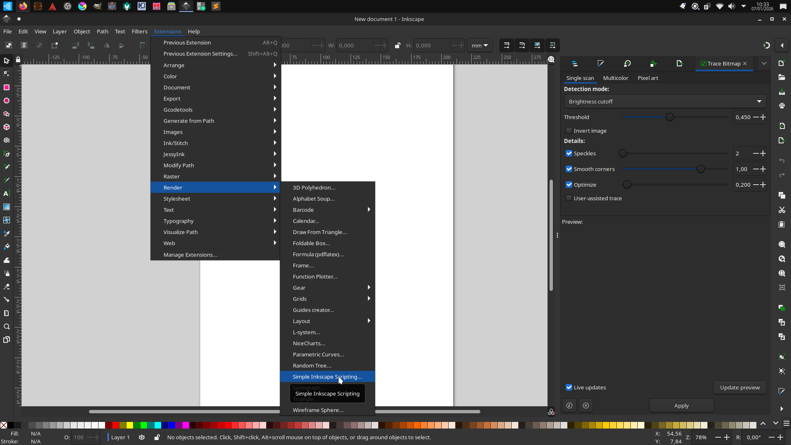
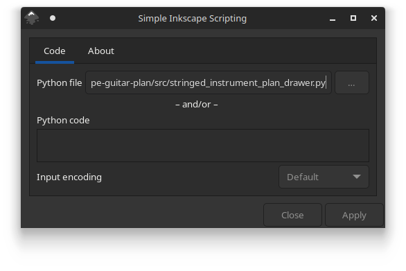
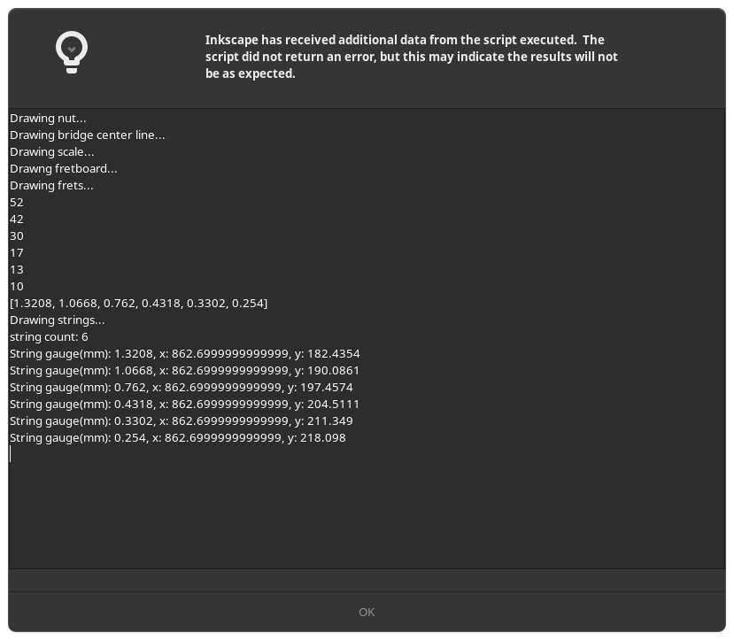
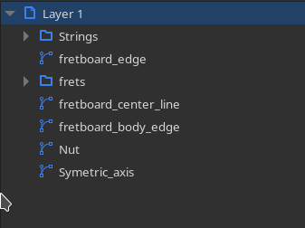

# Inkscape-guitar-plan
## What it is
An Python script that turns fretted string instrument geometry into precise vector drawings for Inkscape.

It automate top-view drawing of:
- Fretboard
- Nut
- Scale
- Symetric axis
- Fret's positions
- Strings

Then you can freely make your own body, headstock, etc.

## Why this project exists
As a guitar builder hobbyist, I need to laser cut template.
The available laser cutting machine around me support svg files, so
I used Inkscape, and then this script is born. 

## Project status
No update scheduled for now
but some idea, like drawing pickup template or drawing side-view

## How to run
**Note that you have to know basic stringed instrument's parameter to use the script efficiently**

**Customize:**
You will want to use custom parameters specific to your own instrument.

1. Open the `src/stringed_instrument_plan_drawer.py` with any text editor software.
2. Go at the end of the files and change values:
```python
# General inputs
symetric_y = 200 #value represent position on y axis
bridge_x = 215

# guitar's value
# /!\ Update to fit you own requirement

scale_length = 25.5*inch_to_mm
bridge_string_spread = 51.5
fingerboard_bass_margin = 2.5
fingerboard_treble_margin = 2.5
nut_length = 44.45 #with margin integrated

string_gauge = (10, 13, 17, 30, 42, 52)
```


- **Symetric_y:** is the vertical position of the symetric axis (= center line)
- **bridge_x:** is the position of where the strings meet the bridge on the horizontal axis
- **scale_lenght:** it is the scale of your instrument
- **bridge_string_spread:** it is the expected distance between each strings
- **fingerboard_bass_margin** & **finger_board_treble_margin:** it's the distance between outer strings and fretboard edge. *NB: it can only draw regular margin for each side*
- **nut_length:** the lenght of the nut, so the width of the fretboard at the nut.
- **string_gauche:** It's an array of each string's gauge.

*Note: I used mm for all the value. You can use inch but in this case you will just has to multiply this value by the conversion rate:* `<your value> * inch_to_mm`

**Execution:**

1. Install Inkscape *I use Inkscape 1.2.2 (b0a8486541, 2022-12-01) on Ubuntu studio*
2. Install and set up `Simple Inkscape Scripting` [Official repo](https://github.com/spakin/SimpInkScr)
3. Go in `Extensions > Render > Simple Inkscape Scripting`

4. In the pop up, set the script in the `Python file` field

5. Let the `Python code` textfield empty.
6. Click on `Apply`.
7. You will see an popup with script's textul output.
It will help you to check that it is error free. You can just close it.

8. Check the draw

9. Then, I strongly suggest to rename different layer, path & object to keep it clear.



## Example
Check `example` folder.

## License
It is licensed under GNU GPL V3

## Special thanks
- Thanks to [Scott Pakin](https://inkscape.org/fr/~pakin/) for the `Inkscape Simple Scripting` extension
- Thanks to Inkscape teams